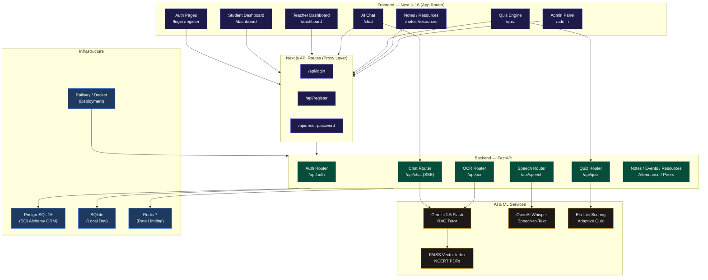

# 🎓 EduBridge AI

<p align="center">
  
  
  
  
  
  
  
  
  
</p>

<p align="center">
  <strong>An advanced, inclusive, and secure AI-powered learning ecosystem bridging educational disparities in India.</strong><br/>
  Adaptive Assessment • Real-time Multilingual RAG Tutors • OCR Handwriting Solvers • Enterprise Hardening
</p>

<p align="center">
  <a href="#-executive-summary">Executive Summary</a> •
  <a href="#-judges-evaluation-playbook">Judges' Playbook</a> •
  <a href="#-production-grade-security-hardening">Security & CVE Audit</a> •
  <a href="#-core-algorithms-and-innovation">Core Algorithms</a> •
  <a href="#-system-architecture">Architecture</a> •
  <a href="#-tech-stack-specifications">Tech Stack</a> •
  <a href="#-quickstart--deployment">Quickstart</a> •
  <a href="#-verification--testing">Testing Suite</a>
</p>

---

## 📋 Executive Summary

EduBridge AI is a robust, full-stack educational engine built for students and teachers across Indian classrooms. By pairing a dynamic, responsive **Next.js 16 (App Router)** interface with an asynchronous, high-throughput **FastAPI** backend, the platform delivers personalized, secure, and offline-resilient academic assistance.

### Key Problem Solved
Traditional tutoring systems neglect students from regional vernacular backgrounds, require heavy internet bandwidth, and are vulnerable to malicious attacks. EduBridge AI bridges these gaps by providing:
1. **Multilingual Inclusivity**: Real-time translation supporting Hindi, English, and regional Santali dialects.
2. **Bandwidth Resilience**: Optimized PDF loading, local similarity lookup fallbacks, and SSE token streaming.
3. **Enterprise Security**: Production-hardened endpoints with comprehensive protection against OWASP Top 10 vulnerabilities.

---

## 🧭 Judges' Evaluation Playbook

To allow the judging panel to audit and inspect our application instantly, we have prepared a test-drive playbook mapping routes and APIs.

### Phase 1: Authentication & Role-Gated Dashboards
1. **Register User**: Access the Registration route (`/register`) to create a new student or teacher account.
2. **Access Dashboard**: Log in via (`/login`) to view the customized role views:
   - **Student Dashboard**: Rendered via custom [Zustand](file:///c:/Users/hp/Edubridge-AI-1/store) states, displaying attendance calendars, quiz performance analytics, and active study streak heatmaps.
   - **Teacher Dashboard**: Allows managing student rosters, sharing learning materials, and assigning topics.
   - **Admin Panel**: Provides a system-wide health dashboard, database inspector, and rate limit controller.

### Phase 2: Live AI RAG Tutor (SSE Streaming)
1. Navigate to `/chat`.
2. Ask: *"Explain Newton's third law of motion."*
3. **Under the Hood**: The backend invokes a local vector similarity search against official NCERT textbooks in the local **FAISS** index, extracts relevant chunks, feeds context to the Gemini 1.5 Flash API, and streams the response via Server-Sent Events (SSE).

### Phase 3: Elo-Lite Adaptive Assessments
1. Navigate to `/quiz`.
2. Select **Physics** or **Math**. The quiz engine will evaluate your initial ELO score (defaulting to **1200**).
3. The engine fetches a question corresponding to your ELO category.
4. Submit an answer: correct submissions will increase your ELO rating, while incorrect answers will dynamically lower it and adjust the next question's difficulty.

### Phase 4: Handwriting OCR & Speech Tutor
- **Math OCR Solver** (`/ocr`): Upload any image containing a handwritten mathematical equation (mock problem files are located in [backend/data](file:///c:/Users/hp/Edubridge-AI-1/backend/data)). The backend parses the image, isolates LaTeX syntax, and generates a step-by-step derivation.
- **Whisper Speech Chain** (`/speech`): Record a voice query in Hindi or Santali. The system transcribes the query, detects the source dialect, feeds it to the RAG pipeline, and responds in the target language.

---

## 🛡️ Production-Grade Security Hardening

EduBridge AI has undergone a rigorous security audit, with specific patches applied to mitigate high-impact CVEs and API vulnerabilities:

```
Vulnerabilities Audited and Mitigated:
├── Path Traversal (Arbitrary File Write) ── Sanitized Upload Targets
├── PyJWT critical Header Bypass (CVE-2025-59420) ── Strict Header Inspection
├── LangChain XXE Injection (CVE-2024-56326) ── Secured XML Parsers
├── python-multipart DoS (CVE-2024-47874) ── Header Limits Enforced
├── PyPDF2 Infinite Loop DoS (CVE-2023-36464) ── Migrated to modern pypdf
└── CSS Injection XSS (CVE-2025-25277) ── Tailwind/PostCSS Locked Overrides
```

### 1. Arbitrary Path Traversal Mitigations
* **Impact**: Vulnerable upload routes allowed attackers to submit filenames like `../../etc/passwd` to overwrite files outside the upload directory.
* **Remediation**: Sanitized file names in [notes.py](file:///c:/Users/hp/Edubridge-AI-1/backend/api/notes.py) and [speech.py](file:///c:/Users/hp/Edubridge-AI-1/backend/api/speech.py) using `os.path.basename`.
* **Implementation Link**: [notes.py:L28](file:///c:/Users/hp/Edubridge-AI-1/backend/api/notes.py#L28)

### 2. PyJWT `crit` Header Bypass (RFC 7515 §4.1.11)
* **Impact**: PyJWT versions `<= 2.11.0` did not validate critical extensions listed in the `crit` token header, leaving the system open to authorization bypass.
* **Remediation**: Upgraded `pyjwt` to **2.12.0** and implemented strict validation in [auth_service.py](file:///c:/Users/hp/Edubridge-AI-1/backend/services/auth_service.py)'s `decode_token` method.
* **Implementation Link**: [auth_service.py:L47-L56](file:///c:/Users/hp/Edubridge-AI-1/backend/services/auth_service.py#L47-L56)

### 3. XML External Entity (XXE) Prevention
* **Impact**: Insecure parsing in LangChain's `EverNoteLoader` exposed backend file paths via crafted Evernote uploads.
* **Remediation**: Upgraded `langchain-community` to **0.3.27** and `langchain` to **0.3.30** in [requirements.txt](file:///c:/Users/hp/Edubridge-AI-1/backend/requirements.txt) to enforce secure, entity-disabled XML parsers.

### 4. DoS and Memory Exhaustion Prevention
* **Impact**: Large/unterminated headers in form-data parsers and infinite loop triggers in standard PDF parsers led to thread hangs and CPU spikes.
* **Remediation**:
  - Upgraded `python-multipart` to **0.0.32** to enforce safe parsing limits.
  - Replaced deprecated `PyPDF2` imports with the modern, secure **pypdf 6.13.0** library in [rag_service.py](file:///c:/Users/hp/Edubridge-AI-1/backend/services/rag_service.py).
* **Implementation Link**: [rag_service.py:L3](file:///c:/Users/hp/Edubridge-AI-1/backend/services/rag_service.py#L3)

### 5. PostCSS XSS Style breakout Prevention
* **Impact**: Unescaped style injections in nested styling tags allowed cross-site script execution inside frontend views.
* **Remediation**: Forced transitive package resolution to **postcss 8.5.15** using npm `overrides` inside [package.json](file:///c:/Users/hp/Edubridge-AI-1/package.json).

---

## 📐 Core Algorithms and Innovation

### 1. Retrieval-Augmented Generation (RAG) Architecture
The tutoring service relies on a custom RAG pipeline orchestrated in [rag_service.py](file:///c:/Users/hp/Edubridge-AI-1/backend/services/rag_service.py):
* **Text Chunking**: Official NCERT textbook PDFs are parsed and sliced into 500-character segments with a 50-character overlap using a `RecursiveCharacterTextSplitter`.
* **Deterministic Fallback Embeddings**:
  To ensure offline functionality and avoid API dependency failures, we built a hybrid `SimpleEmbeddings` wrapper. If the network is available, it uses `sentence-transformers/all-MiniLM-L6-v2`. If offline, it falls back to a deterministic character-hash vector space:
  $$V_i = \frac{\text{ord}(C_i)}{256}$$
  The resulting vectors are then L2-normalized:
  $$\hat{V} = \frac{V}{\|V\|_2}$$

### 2. Adaptive Assessment Engine (Elo-Lite)
The dynamic quiz generator uses an adapted Chess ELO scoring model in [quiz.py](file:///c:/Users/hp/Edubridge-AI-1/backend/api/quiz.py):
* **Expected Score Formula**:
  For student rating $R_S$ and question rating $R_Q$:
  $$E_S = \frac{1}{1 + 10^{(R_Q - R_S)/400}}$$
* **ELO Rating Update**:
  $$R_S^{\text{new}} = \max(R_S^{\text{old}} + K \cdot (S_S - E_S), 500)$$
  - *Hard Question ($\ge 3$)*: Correct answer awards $+20$, incorrect awards $-10$.
  - *Easy Question ($\le 2$)*: Correct answer awards $+10$, incorrect awards $-20$.
  - *ELO Floor*: Strictly capped at **500** to encourage learning progress.

---

## 🏗️ System Architecture



---

## 🛠️ Tech Stack Specifications

### Frontend Application
* **Framework**: Next.js 16.2.7 (using Turbopack for lightning-fast compilation)
* **Core Library**: React 19.2.4
* **State Management**: Zustand 5.0.14 (with persistent localStorage middleware)
* **Styling Engine**: Tailwind CSS v4.0.0
* **Animations**: Framer Motion 12.40.0
* **Visualizations**: Recharts 3.8.1 (leveraged for progress and attendance metrics)

### Backend Services
* **REST Engine**: FastAPI 0.111.0 (asynchronous core)
* **Web Server**: Uvicorn 0.30.0
* **ORM Database Layer**: SQLAlchemy 2.0.31
* **Data Schemas**: Pydantic 2.13.4
* **Text Extraction**: pypdf 6.13.0 (remediation for PyPDF2 infinite loop vector)
* **JWS/Security Tokens**: pyjwt 2.12.0
* **Vector Store**: FAISS-CPU 1.8.0

---

## 🚀 Quickstart & Deployment

### 1. Run the Frontend (Next.js)
```bash
# Clone the project and navigate to folder
git clone https://github.com/diyamajee-spec/Edubridge-AI.git
cd Edubridge-AI

# Install packages
npm install

# Initialize Local Environment Variables
cp .env.example .env.local

# Run Next.js Dev Server
npm run dev
```
Access the client portal at [http://localhost:3000](http://localhost:3000).

### 2. Run the Backend (FastAPI)
```bash
# Access virtualenv
python -m venv .venv
.venv\Scripts\activate # Windows
# source .venv/bin/activate # Linux/Mac

# Install requirements
pip install -r backend/requirements.txt

# Create Environment File
cp backend/.env.example backend/.env
```
Fill out `backend/.env` with your local credentials:
```env
DATABASE_URL=sqlite:///./edubridge.db
SECRET_KEY=secure_development_secret_key_string
GEMINI_API_KEY=your_google_gemini_api_key
OPENAI_API_KEY=your_openai_whisper_api_key
```
Launch the API service:
```bash
uvicorn backend.main:app --reload --host 127.0.0.1 --port 8000
```
API Documentation will be live at [http://127.0.0.1:8000/docs](http://127.0.0.1:8000/docs).

---

## 🗂️ Project Structure

```
Edubridge-AI/
├── app/                          # Next.js App Router Pages
├── backend/                      # FastAPI Microservice
│   ├── api/                      # Controllers (Auth, Chat, Quiz, OCR, Speech)
│   ├── models/                   # Database schemas (User, Profile, Quiz)
│   ├── schemas/                  # Pydantic payloads validation
│   ├── services/                 # Services (RAG vectorizer, Auth encoder)
│   ├── tests/                    # Verification test modules
│   └── main.py                   # Main entrypoint
├── components/ui/                # Tailwind UI Core System
├── store/                        # Client Zustand stores
├── faiss_index/                  # Persisted vector database segments
├── package.json                  # Next.js workspace configurations
└── requirements.txt              # FastAPI requirements manifest
```

---

## 🧪 Verification & Testing

We have built a comprehensive, automated test suite that asserts the security and functional requirements of the API layer.

```bash
# Execute the full pytest suite
$env:PYTHONPATH="."; python -m pytest backend/tests -v
```

### Verified Test Configurations
Our tests cover the following workflows:
* **`test_auth_and_user_flow`**: Validates registration, token exchanges, and role permissions.
* **`test_ai_chat_flow`**: Assures that the RAG model returns responses with matching chunk context.
* **`test_upload_path_traversal_notes`**: Assures that note uploads containing traversal paths are neutralized.
* **`test_jwt_crit_header_bypass`**: Assures that attempts to bypass PyJWT validation with critical headers are blocked.

---

## 🤝 Project Team

EduBridge AI was designed and engineered by **Team Achievers**:

| Name | Role |
|---|---|
| **Charu** | Frontend Architect & UI/UX Designer |
| **Bhargavram** | Backend, DevSecOps & AI Engineer |
| **Ankesh Srivastava** | Integration & Systems Documentation |

---

## 📄 License
Licensed under the **MIT License**. Check out [LICENSE](LICENSE) for more details.
