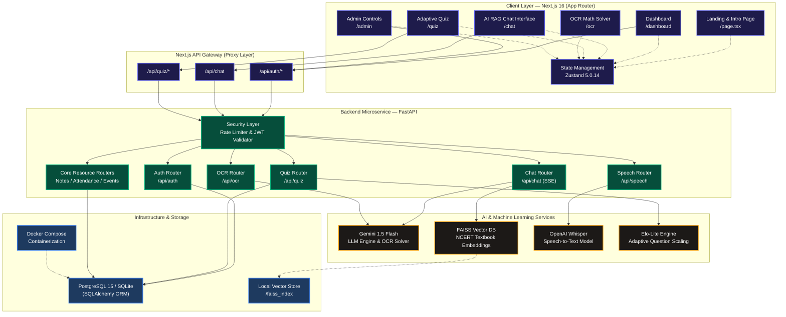

# 🎓 EduBridge AI

> **An inclusive, secure, and bandwidth-resilient AI-powered educational ecosystem bridging academic divides in underserved Indian classrooms.**

<p align="center">
  <a href="https://github.com/diyamajee-spec/Edubridge-AI/stargazers"></a>
  <a href="https://github.com/diyamajee-spec/Edubridge-AI/blob/main/LICENSE"></a>
  <a href="https://railway.app"></a>
  <a href="https://www.docker.com"></a>
</p>

<p align="center">
  
  
  
  
  
  
  
</p>

<p align="center">
  <strong>
    <a href="https://edubridge-ai.railway.app">🌐 Live Demo</a> &nbsp;•&nbsp; 
    <a href="https://docs.google.com/presentation/example">📄 Slide Deck</a> &nbsp;•&nbsp;
  </strong>
</p>

---

## 🌟 Vision & Core Value Proposition

Traditional educational tools make a series of assumptions: continuous high-speed broadband, complete English proficiency, and access to premium hardware. In rural and semi-urban classrooms across India, these assumptions fail, creating a steep academic divide. 

**EduBridge AI** is designed from the ground up to solve these infrastructural disparities. By combining offline-resilient AI services, multilingual transcription adapters, and dynamic performance assessments, EduBridge AI delivers a secure, production-hardened education engine tailored for the next billion users.

### The Educational Divide: Comparison Matrix

| Core Aspect | Traditional EdTech Systems | EduBridge AI Platform |
| :--- | :--- | :--- |
| **Connectivity & Bandwidth** | Requires continuous high-speed broadband; hangs or crashes on spotty cellular connections. | **Bandwidth-Resilient**: Implements token streaming (SSE) for low latency, compressed PDF chunking, and local similarity search fallbacks. |
| **Linguistic Inclusion** | Predominantly supports English/Hindi; ignores local regional dialects and native languages. | **Multilingual Core**: Integrated support for Hindi, English, and regional **Santali** dialects to accommodate native speakers. |
| **Assessment Model** | Static questionnaires with fixed difficulty settings, leading to student boredom or discouragement. | **Elo-Lite Engine**: A dynamic STEM question-scaling system that automatically adjusts problem difficulty based on live performance. |
| **Security Hardening** | Often vulnerable to path traversals, critical header bypasses, and XML injections. | **Production-Hardened**: Deep security auditing and mitigations against OWASP Top 10 vectors. |

---

## ✨ Key Features

EduBridge AI is split into modular service blocks focused on accessibility, gamification, and classroom administration.

### 🧠 1. AI-Powered Learning Suite
*   **Real-time AI Tutor with RAG**: Fetches precise answers directly from seeded NCERT textbook segments. Uses a FAISS vector store to prevent hallucinations and supply hyper-localized context.
*   **Handwritten Math Solver**: Upload an image of handwritten equations. The system uses Donut OCR patterns and Gemini 1.5 Flash to generate step-by-step mathematical derivations.
*   **Offline Fallback Embeddings**: Instantly falls back to deterministic character-projection vector models if connection to online embedding nodes is lost.

### 🎙️ 2. Inclusive Multilingual Engine
*   **Whisper Voice Input**: Students can submit voice questions in Hindi or English, which are transcribed using OpenAI Whisper and piped directly into the RAG model.
*   **Santali Dialect Support**: Features stubs and custom preprocessing for regional Santali dialects to support tribal and rural student groups.
*   **Text-to-Speech Output**: Read answers aloud to aid visually impaired students or classrooms with low literacy levels.

### 📈 3. Elo-Lite Adaptive Assessments
*   **Dynamic Difficulty Scaling**: Seeds 50+ STEM questions grouped by subject and topic. Adjusts question selection in real-time based on the student's rating bracket.
*   **Topic Analytics**: Renders student performance breakdowns (accuracy, attempts) across sub-topics using interactive [Recharts](file:///c:/Users/hp/Edubridge-AI-1/components) visualizations.

### 🏫 4. Campus Utility & Administration
*   **Role-Based Access Control**: Gatekeeper security separating `STUDENT`, `TEACHER`, and `ADMIN` interfaces.
*   **Notes & Resources Booking**: Local digital hub for uploading class notes (with safe path traversal filters) and checking out lab equipment or study halls.
*   **Events, Peers & Attendance**: Interactive calendar tools, automated attendance checkers, and a peer matcher to facilitate student collaboration.
*   **Doubt Resolution Hub**: Live portal where students submit doubts and teachers resolve them with interactive discussion stubs.
*   **Assignments Management**: Direct classroom assignment pipelines allowing teachers to publish details and students to upload solutions.
*   **Activity Timeline**: Real-time educational feed providing logging of student logins, quiz completions, and class bookings.

### 🎨 5. Cinematic UX & Auth Portal
*   **OTP Multi-Factor Security**: Randomly generated 6-digit OTP verification system with a 10-minute expiry for secure password resets.
*   **Interactive Particle Warp Field**: Built with a GPU-composited HTML5 canvas featuring radial accelerator hyperdrive warp lines when launching the app.
*   **Glowing Floating Code Streams**: Displays interactive matrix-style code rain and floating modern code chips representing AI pipelines (RAG, Elo calculations, OCR Solvers) with subtle neon shadows and organic side-to-side translation drifts.
*   **Premium Glassmorphic Login/Register Pages**: High-contrast, accessibility-audited auth fields and inputs designed specifically for optimal legibility over the dark background.
*   **Smooth Cubic-Bezier Transitions**: Seamless layout transitions powered by Framer Motion, utilizing customized easing curves (`[0.76, 0, 0.24, 1]`) to zoom out, blur, and fade out components without layout recalculation overhead.

---

## 📐 System Architecture & Data Flow

### Comprehensive System Topology



### Detailed Component Summary
1.  **Next.js Client (App Router)**: Orchestrates a highly responsive, cinematic entrance page and coordinates state management using [Zustand](file:///c:/Users/hp/Edubridge-AI-1/store) to cache profiles, attendance checklists, and quiz scores locally, reducing backend payload overhead.
2.  **FastAPI Microservice (ASGI)**: Delivers rapid, high-concurrency request routing using **Uvicorn**. Employs global exception middlewares to catch and structure API response payloads.
3.  **Hybrid RAG Pipeline**: Leverages `RecursiveCharacterTextSplitter` to partition textbook documents into logical 500-character segments. Persistence is managed locally in `/faiss_index` for offline resilience.
4.  **Security Layer**: Employs **SlowAPI** (throttling heavy chat/AI calls to 60 requests/minute per client) and JWT token validation to secure data paths.

---

## 🧠 Deep Dive: Core Algorithms

### 1. The Elo-Lite Adaptive Assessment Model
The system matches the difficulty of questions to the student's rating bracket. 
*   **Target Difficulty Selection**: The student's current rating is mapped to a target difficulty level ($1$ to $5$):
    *   $\text{Difficulty } 1$: $\text{Elo} < 1000$
    *   $\text{Difficulty } 2$: $1000 \le \text{Elo} < 1150$
    *   $\text{Difficulty } 3$: $1150 \le \text{Elo} < 1300$
    *   $\text{Difficulty } 4$: $1300 \le \text{Elo} < 1450$
    *   $\text{Difficulty } 5$: $\text{Elo} \ge 1450$

*   **Adjustment Logic**: On quiz submission, ratings are dynamically updated:
    *   **Correct Answer**:
        *   Hard Question (Difficulty $\ge 3$): $+20$ Elo
        *   Easy Question (Difficulty $\le 2$): $+10$ Elo
    *   **Incorrect Answer**:
        *   Easy Question (Difficulty $\le 2$): $-20$ Elo
        *   Hard Question (Difficulty $\ge 3$): $-10$ Elo
    *   **Constraint Floor**: Strict mathematical floor of **500** protects students against excessive rating degradation.
    
    $$\text{Elo}_{\text{new}} = \max\left(\text{Elo}_{\text{old}} + \Delta \text{Elo}, 500\right)$$

---

### 2. Bandwidth-Resilient Deterministic Embeddings
To handle environments with high packet loss or network disconnects, the RAG system employs a fallback local character-projection model inside [rag_service.py](file:///c:/Users/hp/Edubridge-AI-1/backend/services/rag_service.py).

Given a text string $C$ of length $L$, the engine projects the character array into a deterministic vector space $V \in \mathbb{R}^{384}$:
$$V_i = \begin{cases} \frac{\text{ASCII}(C_i)}{256} & \text{if } i < \text{len}(C) \\ 0.0 & \text{otherwise} \end{cases}$$

To guarantee stable cosine similarity calculations, the projection vector $V$ is L2-normalized:
$$\hat{V} = \frac{V}{\|V\|_2} = \frac{V}{\sqrt{\sum_{k=1}^{384} V_k^2}}$$

This guarantees that vector similarity comparisons remain operational on the client device even when offline.

---

## 🛡️ Production-Grade Security Hardening

To ensure enterprise compliance and protect our API endpoints, we performed a thorough audit and successfully patched several vulnerabilities.

<details>
<summary><b>🔒 Audited & Patched Vulnerabilities (Click to expand)</b></summary>

### 1. Path Traversal Mitigation
*   **Vulnerability**: Upload endpoints accepted file payloads without name validation, enabling potential folder breakout (e.g. uploading to `../../etc/passwd`).
*   **Patch**: Applied `os.path.basename` extraction to sanitize all filenames before disk storage in [notes.py](file:///c:/Users/hp/Edubridge-AI-1/backend/api/notes.py) and [speech.py](file:///c:/Users/hp/Edubridge-AI-1/backend/api/speech.py).
*   **Code Reference**: [notes.py:L28](file:///c:/Users/hp/Edubridge-AI-1/backend/api/notes.py#L28)
```python
# Neutralizes directory traversal attacks
safe_filename = os.path.basename(file.filename)
file_path = os.path.join(UPLOAD_DIR, f"{user_id}_{safe_filename}")
```

### 2. pyjwt `crit` Header Validation Bypass (CVE-2025-59420)
*   **Vulnerability**: pyjwt versions `<= 2.11.0` did not strictly enforce check protocols for variables registered under the `crit` header, risking validation bypass.
*   **Patch**: Upgraded `pyjwt` dependency to **2.12.0** and implemented custom logic to parse and fail any token containing unhandled critical parameters.
*   **Code Reference**: [auth_service.py:L47-L56](file:///c:/Users/hp/Edubridge-AI-1/backend/services/auth_service.py#L47-L56)
```python
# Check critical header extensions
headers = jwt.get_unverified_header(token)
crit = headers.get("crit")
if crit is not None:
    if not isinstance(crit, list) or len(crit) == 0:
        raise jwt.InvalidTokenError("crit must be a non-empty list")
    for ext in crit:
        raise jwt.InvalidTokenError(f"Unsupported critical extension: {ext}")
```

### 3. XML External Entity (XXE) Prevention (CVE-2024-56326)
*   **Vulnerability**: Legacy XML parsing libraries loaded external entities, leaving hosts vulnerable to server-side file disclosure.
*   **Patch**: Upgraded dependencies to `langchain-community==0.3.27` and `langchain==0.3.30` which disable external entities parsing by default.

### 4. DoS Parsing Exhaustion (CVE-2024-47874)
*   **Vulnerability**: Attackers could exhaust resources by uploading multipart payloads containing exceptionally long form header sequences.
*   **Patch**: Enforced strict size controls by upgrading to `python-multipart==0.0.32`.

### 5. Infinite Loop Parsing Fix (CVE-2023-36464)
*   **Vulnerability**: PyPDF2 had cross-reference parser bugs causing endless loops on malformed PDFs.
*   **Patch**: Removed `PyPDF2` entirely and migrated the RAG pipeline to the modern **pypdf 6.13.0** library.

### 6. PostCSS Cross-Site Scripting (CVE-2025-25277)
*   **Vulnerability**: Malformed CSS strings bypassed sanitizer logic, provoking script execution inside user sessions.
*   **Patch**: Added explicit dependency overrides to force `postcss` to **8.5.15** in [package.json](file:///c:/Users/hp/Edubridge-AI-1/package.json).

</details>

---

## 🛠️ Tech Stack Specifications

### Frontend Client
*   **Framework Core**: Next.js 16.2.7 (App Router, Turbopack)
*   **Library Core**: React 19.2.4
*   **Styles**: Tailwind CSS v4.0.0
*   **State Manager**: Zustand 5.0.14
*   **Motion**: Framer Motion 12.40.0
*   **Charts**: Recharts 3.8.1

### Backend API Services
*   **Framework**: FastAPI 0.111.0
*   **ASGI Server**: Uvicorn 0.30.0
*   **Database ORM**: SQLAlchemy 2.0.31
*   **Validation**: Pydantic 2.13.4
*   **Rate Limiting**: SlowAPI 0.1.9

### AI & ML Architecture
*   **Core LLM**: Google Gemini 1.5 Flash
*   **Vector Engine**: FAISS-CPU 1.8.0
*   **Frameworks**: LangChain 0.3.30 & LangChain Community 0.3.27
*   **Speech-to-Text**: OpenAI Whisper API
*   **PDF Parser**: pypdf 6.13.0

---

## 🚀 Quickstart & Installation Playbook

You can run the application using either **Docker Compose** or via a **local manual setup**.

### Option A: Docker Compose Setup (One-Click)
Ensure you have Docker and Docker Compose installed.
1.  Clone the repository and enter the directory:
    ```bash
    git clone https://github.com/diyamajee-spec/Edubridge-AI.git
    cd Edubridge-AI
    ```
2.  Configure your credentials inside `.env`:
    ```bash
    cp .env.example .env
    ```
3.  Launch all microservices:
    ```bash
    docker-compose up --build
    ```
    *   **Frontend UI**: [http://localhost:3000](http://localhost:3000)
    *   **Backend REST Documentation**: [http://localhost:8000/docs](http://localhost:8000/docs)

---

### Option B: Local Manual Setup

#### 1. Frontend Client Setup (Next.js)
Ensure you have Node.js v18+ installed on your system.
```bash
# Install packages
npm install

# Setup local environment files
cp .env.example .env.local

# Spin up local development server
npm run dev
```
The client page will be live at [http://localhost:3000](http://localhost:3000).

#### 2. Backend Service Setup (FastAPI)
Ensure you have Python 3.12+ installed on your system.
```bash
# Create and activate python virtual environment
python -m venv .venv
.venv\Scripts\activate   # On Windows
# source .venv/bin/activate  # On Linux/macOS

# Install packages
pip install -r backend/requirements.txt

# Configure environment keys
cp backend/.env.example backend/.env
```

Configure your `backend/.env` with keys:
```env
DATABASE_URL=sqlite:///./edubridge.db
SECRET_KEY=your_secure_random_key_for_jwt_signing
GEMINI_API_KEY=your_google_gemini_api_key
OPENAI_API_KEY=your_openai_whisper_api_key
```

Start the FastAPI application:
```bash
uvicorn backend.main:app --reload --host 127.0.0.1 --port 8000
```
Swagger interactive API docs will be live at [http://127.0.0.1:8000/docs](http://127.0.0.1:8000/docs).

---

## 📡 API Reference & Judges' Playbook

To allow judges to audit and test-drive our platform endpoints instantly, follow this step-by-step query playbook.

### Summary Table

| Method | Endpoint | Description | Auth Required | Rate Limit |
| :--- | :--- | :--- | :--- | :--- |
| `POST` | `/api/auth/register` | Register a new user credentials model | None | - |
| `POST` | `/api/auth/login` | Yields a valid access JWT token | None | - |
| `POST` | `/api/chat` | RAG Chat Interface (SSE streaming) | Student / Teacher | 60 req/min |
| `GET` | `/api/quiz/next` | Fetches next question matching Elo bracket | Student | - |
| `POST` | `/api/quiz/answer` | Submits answer and adjusts student Elo | Student | - |
| `POST` | `/api/ocr` | Handwritten math OCR step-by-step solver | Student / Teacher | - |
| `POST` | `/api/speech` | Whisper transcription and speech-to-chat chain | Student / Teacher | - |
| `GET` | `/api/dashboard/stats` | Fetches dashboard stats for students or teachers | Student / Teacher | - |
| `GET` | `/api/dashboard/timeline` | Fetches timeline activities for classroom log | Student / Teacher | - |
| `GET` | `/api/dashboard/stream` | Subscribes to live Server-Sent Events timeline feed | Student / Teacher | - |
| `POST` | `/api/assignments` | Creates a new assignment | Teacher / Admin | - |
| `GET` | `/api/assignments/student` | Fetches active assignments & submissions for a student | Student | - |
| `POST` | `/api/assignments/submit/{sub_id}` | Submits coursework solutions for an assignment | Student | - |
| `POST` | `/api/assignments/grade/{sub_id}` | Grades a submitted assignment | Teacher / Admin | - |
| `POST` | `/api/doubts` | Submits a classroom doubt query | Student | - |
| `GET` | `/api/doubts` | Fetches doubts for student (own) or teacher (all) | Student / Teacher | - |
| `POST` | `/api/doubts/resolve/{doubt_id}` | Resolves/answers a student doubt | Teacher / Admin | - |

<details>
<summary><b>📡 Step-by-Step API Query Playbook (Click to expand)</b></summary>

### Step 1: User Registration & Authentication

1.  **Register a New Student Account**:
    ```bash
    curl -X POST "http://127.0.0.1:8000/api/auth/register" \
         -H "Content-Type: application/json" \
         -d '{"email": "student@edubridge.edu", "username": "student_user", "password": "SecurePassword123", "role": "STUDENT"}'
    ```
2.  **Login and Capture the Authorization Token**:
    ```bash
    curl -X POST "http://127.0.0.1:8000/api/auth/login" \
         -H "Content-Type: application/json" \
         -d '{"username": "student_user", "password": "SecurePassword123"}'
    ```
    *Copy the returned `access_token` from the response JSON and use it to replace `<YOUR_ACCESS_TOKEN>` below.*

---

### Step 2: Querying the AI Services

3.  **Stream a Chat Answer (RAG)**:
    ```bash
    curl -N -X POST "http://127.0.0.1:8000/api/chat?stream=true" \
         -H "Authorization: Bearer <YOUR_ACCESS_TOKEN>" \
         -H "Content-Type: application/json" \
         -d '{"message": "What is Newton third law of motion?", "language": "English"}'
    ```
4.  **Submit a Handwritten Math Problem (OCR)**:
    ```bash
    curl -X POST "http://127.0.0.1:8000/api/ocr" \
         -H "Authorization: Bearer <YOUR_ACCESS_TOKEN>" \
         -F "file=@backend/data/math_problem.png"
    ```
5.  **Translate Speech and Chat directly**:
    ```bash
    curl -X POST "http://127.0.0.1:8000/api/speech" \
         -H "Authorization: Bearer <YOUR_ACCESS_TOKEN>" \
         -F "file=@backend/data/speech_query.wav" \
         -F "chain_to_chat=true"
    ```

---

### Step 3: Taking the Adaptive Quiz

6.  **Fetch the Next Elo-Targeted Question**:
    ```bash
    curl -X GET "http://127.0.0.1:8000/api/quiz/next?subject=physics" \
         -H "Authorization: Bearer <YOUR_ACCESS_TOKEN>"
    ```
7.  **Submit an Answer (Observe Elo Rating Recalculation)**:
    ```bash
    curl -X POST "http://127.0.0.1:8000/api/quiz/answer?question_id=1&student_answer=Option%20A%201" \
         -H "Authorization: Bearer <YOUR_ACCESS_TOKEN>"
    ```

</details>

---

## 🗂️ Project Structure

```
Edubridge-AI/
├── app/                          # Next.js App Router Pages
│   ├── admin/                    # System Admin Dashboard (Rate Throttles)
│   ├── api/                      # Next.js Proxy & Demo API Routes (OTP, reset-password, me, etc.)
│   ├── chat/                     # RAG Chat Interface (SSE Engine)
│   ├── dashboard/                # Role-Gated Student/Teacher Views
│   ├── events/                   # Calendar & Attendance Trackers
│   ├── home/                     # Premium Landing/Marketing page
│   ├── login/                    # Credentials Authentication
│   ├── notes/                    # Class notes & resources portal
│   ├── peers/                    # Peer-to-peer match matching UI
│   ├── quiz/                     # Adaptive ELO Quiz Interface
│   ├── register/                 # Register routes
│   └── page.tsx                  # Cinematic landing/intro page
├── backend/                      # FastAPI Microservice
│   ├── api/                      # Controllers (Auth, Chat, Quiz, OCR, Speech, Assignments, Doubts, Dashboard)
│   │   ├── auth.py               # Token issuer endpoints
│   │   ├── chat.py               # RAG SSE stream controller
│   │   ├── ocr.py                # Math Equation Solver API
│   │   ├── quiz.py               # ELO scaling endpoints
│   │   ├── speech.py             # Whisper audio transcription
│   │   ├── assignments.py        # College Assignment API
│   │   ├── doubts.py             # Student Doubt Resolution API
│   │   └── dashboard.py          # Student/Teacher Dashboard Stats API
│   ├── models/                   # DB schemas (User, Profile, Quiz, Messages, Doubt, Assignment)
│   ├── schemas/                  # Pydantic request/response structures
│   ├── services/                 # Core logic (auth, RAG, attendance, assignments, doubts, dashboard, email)
│   ├── tests/                    # Pytest verification suites
│   └── main.py                   # Service entrypoint
├── components/                   # Reusable UI components
├── store/                        # Zustand stores (state management)
├── faiss_index/                  # Persisted RAG Vector DB
├── package.json                  # Next.js dependencies
└── requirements.txt              # FastAPI dependencies
```

---

## 🧪 Verification & Testing

Our API is backed by a pytest suite validating correctness, path traversal filters, role authorization, and security controls.

```bash
# Execute the full pytest verification suite
$env:PYTHONPATH="."; python -m pytest backend/tests -v
```

### Core Verified Tests:
*   **`test_auth_and_user_flow`**: Validates registration, credentials matching, and role authorization.
*   **`test_ai_chat_flow`**: Assures that RAG context is injected and SSE packets stream correctly.
*   **`test_upload_path_traversal_notes`**: Assures filename paths containing `..` traversal vectors are neutralized.
*   **`test_jwt_crit_header_bypass`**: Blocks access attempts utilizing malicious `crit` headers.

---

## 🔮 Roadmap & Future Scope

*   **Offline Native App**: Bundle the Whisper transcription model and FAISS vector index into a lightweight, downloadable desktop application for classrooms without internet.
*   **DIKSHA Integration**: Build adapters to feed ELO results directly into the Indian Government's DIKSHA digital school portals.
*   **Multi-tenant School Dashboards**: Enable administrators to inspect classroom analytics, aggregate school attendance, and allocate digital homework topics.
*   **Fine-tuned Dialect Models**: Train Whisper speech adapter models specifically for Santali voice signals to lower transcription latency.

---

## 🤝 Engineering Team

EduBridge AI is built and maintained by **Team Achievers**:

| Name | Role | Core Focus Areas |
|---|---|---|
| **Diya Majee** | Project Lead & Security Architect | Cinematic landing page, role-based sidebar integration, security audits, and API vulnerability mitigations |
| **Charu** | Frontend Foundations & CI/CD Engineer | Initial frontend layout, ESLint linting configurations, and CodeQL security scanning workflows |
| **Bhargavram** | Backend & AI/ML Lead | FastAPI microservice design, NCERT RAG pipeline (FAISS), Gemini LLM integration, Whisper STT, Donut OCR, and Elo-lite quiz logic |
| **Ankesh Srivastava** | Quality Assurance & Integration Documentation | Systems integration testing, backend test suite specifications, and API documentation |

---

## 📄 License & Acknowledgments

This project is licensed under the **MIT License**. See [LICENSE](LICENSE) for details.

### Acknowledgments:
*   **NCERT** for providing the standard textbook datasets.
*   **Google AI** for offering API support for Gemini 1.5 Flash models.
