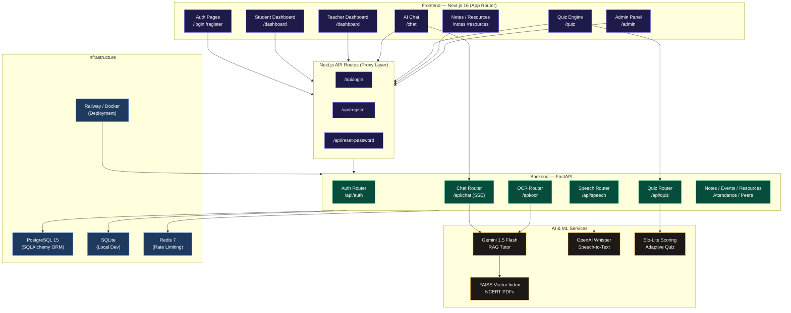

<h1 align="center">🎓 EduBridge AI</h1>
<p align="center">
  
  
  
  
  
  
  
  
  
  
</p>


<p align="center">
  <strong>Next-generation AI-powered learning ecosystem bridging academic divides across India.</strong><br/>
  Adaptive • Personalized • Multilingual • Inclusive
</p>

<p align="center">
  <a href="#-features">Features</a> •
  <a href="#-architecture">Architecture</a> •
  <a href="#-tech-stack">Tech Stack</a> •
  <a href="#-quickstart">Quickstart</a> •
  <a href="#-api-reference">API Reference</a> •
  <a href="#-deployment">Deployment</a>
</p>

---

## Overview

EduBridge AI is a full-stack educational platform built for students and teachers in underserved and mainstream schools alike. It combines a cinematic Next.js 16 frontend with a production-grade FastAPI backend to deliver real-time AI tutoring, adaptive assessments, multilingual speech interaction, and smart campus tooling — all under one roof.

The platform supports three distinct roles — **Student**, **Teacher**, and **Admin** — each with a tailored experience, role-gated dashboards, and access to relevant tools.

---

## ✨ Features

### 🤖 AI Tutor with RAG Pipeline
- Powered by **Google Gemini 1.5 Flash** with retrieval-augmented generation (RAG)
- Ingests **NCERT PDFs** into a **FAISS vector index** using LangChain splitters and custom sentence-transformer embeddings
- Streams responses token-by-token via **Server-Sent Events (SSE)** for a real-time chat experience
- Maintains persistent **chat sessions** and **message history** in the database
- **Rate-limited** to 60 requests/minute per user via SlowAPI

### 🎙️ Multilingual Speech-to-Text
- Transcribes audio uploads using **OpenAI Whisper**
- Detects language automatically via `langdetect` (English, Hindi, Santali stub)
- Supports **speech-to-chat chaining** — speak a question, get an immediate RAG-powered answer

### 📸 Donut OCR Handwritten Solver
- Accepts image uploads of handwritten equations and problems
- Detects LaTeX-like math expressions using regex pattern matching
- Routes to **Gemini** for step-by-step solving or falls back to the RAG tutor for conceptual questions

### 📈 Adaptive Quiz Engine (Elo-Lite)
- **50+ NCERT Physics and Mathematics questions** across 5 difficulty levels, auto-seeded on startup
- Student performance tracked via an **Elo-lite rating system** (ELO floors at 500)
  - Correct on hard (difficulty ≥ 3) → **+20 ELO**
  - Wrong on easy (difficulty ≤ 2) → **−20 ELO**
- Quiz engine selects questions matching the student's current ELO bracket
- Topic-level accuracy analytics available at `/api/quiz/analytics/{student_id}`

### 🔐 Authentication & Security
- **JWT-based authentication** with access + refresh token pair
- **bcrypt** password hashing via `passlib`
- Role-based access control: `STUDENT`, `TEACHER`, `ADMIN`
- **Email normalization** (`.strip().lower()`) before storage and lookup
- **OTP password reset** flow with 10-minute expiry, SMTP delivery (console fallback when unconfigured)
- Persistent auth state via **Zustand + localStorage** (`zustand/persist`)

### 📊 Role-Based Dashboards
- **Student Dashboard**: Progress charts (Recharts), attendance heatmap, quiz ELO tracker, study streak counter, URL-synced tabs
- **Teacher Dashboard**: Class management, attendance marking, material upload, student performance overview
- **Admin Panel**: User management, platform analytics, ban/reset controls, system health charts

### 🏫 Campus Tools
- **Notes** — Upload and manage PDFs/TXT study notes with subject tagging and public/private visibility
- **Resources** — Lab and classroom booking system with time-slot grid and conflict detection
- **Events** — Campus event feed
- **Peers** — Peer matching and group discussion portal
- **Attendance** — Teacher-driven attendance session management

### 🎨 Visual Design
- Cinematic intro sequence with matrix data streams, circular ripple pulses, and a cyber status terminal
- **Dynamic light/dark theme** using CSS custom properties (`@custom-variant dark`) — not hardcoded colors
- Glassmorphism cards, micro-animations via **Framer Motion**, smooth page transitions
- Typography: **Sora** (headings) · **Inter** (body) · **JetBrains Mono** (code/mono accents)

---

## 🏗️ Architecture



---

## 🛠️ Tech Stack

### Frontend
| Technology | Version | Purpose |
|---|---|---|
| **Next.js** | 16.2.7 (Turbopack) | Full-stack React framework, App Router |
| **React** | 19.2.4 | UI library |
| **TypeScript** | 5 | Static typing |
| **Tailwind CSS** | 4 | Utility-first styling |
| **Framer Motion** | 12 | Animations and transitions |
| **Zustand** | 5 | Global state management (with persist) |
| **React Hook Form** | 7 | Form validation |
| **Recharts** | 3 | Analytics charts |
| **next-themes** | 0.4 | Light/dark theme engine |
| **Lucide React** | 1.17 | Icon library |

### Backend
| Technology | Version | Purpose |
|---|---|---|
| **FastAPI** | 0.111 | Async REST API + SSE streaming |
| **SQLAlchemy** | 2.0 | ORM (sync engine, PostgreSQL + SQLite) |
| **Pydantic** | 2.7 | Data validation and schemas |
| **Passlib + bcrypt** | 1.7 | Password hashing |
| **PyJWT** | 2.8 | JWT token signing and verification |
| **LangChain** | 0.2 | RAG pipeline orchestration |
| **FAISS** | 1.8 | Vector similarity search |
| **Google Generative AI** | 0.5 | Gemini 1.5 Flash integration |
| **OpenAI** | 1.30 | Whisper speech transcription |
| **SlowAPI** | 0.1.9 | Rate limiting |
| **Uvicorn** | 0.30 | ASGI server |

### Infrastructure
| Service | Purpose |
|---|---|
| **PostgreSQL 15** | Production relational database |
| **SQLite** | Local development database (zero config) |
| **Redis 7** | Session caching, rate limit counters |
| **Docker Compose** | Local multi-service orchestration |
| **Railway** | Cloud deployment (backend via Dockerfile) |

---

## 🚀 Quickstart

### Prerequisites
- Node.js ≥ 18, npm ≥ 9
- Python 3.10+
- (Optional) Docker Desktop for full-stack local setup

---

### Option A — Frontend Only (Dev Mode)

```bash
# 1. Clone the repository
git clone https://github.com/diyamajee-spec/Edubridge-AI.git
cd Edubridge-AI

# 2. Install dependencies
npm install

# 3. Set up environment
cp .env.example .env.local
# Add BACKEND_URL=http://127.0.0.1:8000 to .env.local

# 4. Start development server
npm run dev
```
Open [http://localhost:3000](http://localhost:3000)

---

### Option B — Full Stack (Backend + Frontend)

#### Backend Setup

```bash
# Create and activate a virtual environment
python -m venv .venv
.venv\Scripts\activate        # Windows
# source .venv/bin/activate   # macOS/Linux

# Install Python dependencies
pip install -r backend/requirements.txt

# Configure environment
cp backend/.env.example backend/.env
```

Edit `backend/.env`:
```env
DATABASE_URL=sqlite:///./edubridge.db   # SQLite for local dev
SECRET_KEY=your-super-secret-key-here
GEMINI_API_KEY=your_gemini_api_key_here
OPENAI_API_KEY=your_openai_api_key_here  # Optional (for Whisper)
SMTP_SERVER=smtp.gmail.com               # Optional (for OTP emails)
SMTP_PORT=587
SMTP_USERNAME=your@email.com
SMTP_PASSWORD=your_app_password
```

```bash
# Start the FastAPI server
uvicorn backend.main:app --reload --host 127.0.0.1 --port 8000
```

The backend auto-creates all database tables and seeds 50+ quiz questions on first startup.
API documentation available at [http://127.0.0.1:8000/docs](http://127.0.0.1:8000/docs).

#### Frontend Setup

```bash
npm install
npm run dev
```

---

### Option C — Docker Compose (Full Stack + PostgreSQL + Redis)

```bash
docker-compose up --build
```

This spins up:
- **PostgreSQL 15** on port `5432`
- **Redis 7** on port `6379`
- **FastAPI backend** on port `8000`

Then in a separate terminal:
```bash
npm install && npm run dev
```

---

## 📡 API Reference

All backend endpoints are prefixed with `/api`. Interactive docs: [`http://localhost:8000/docs`](http://localhost:8000/docs)

### Authentication — `/api/auth`
| Method | Endpoint | Description | Auth |
|---|---|---|---|
| `POST` | `/register` | Register a new user (student/teacher) | — |
| `POST` | `/login` | Login and receive JWT tokens + user object | — |
| `GET` | `/me` | Fetch current authenticated user profile | ✅ Bearer |
| `POST` | `/reset-password` | Request OTP to registered email | — |
| `POST` | `/reset-password/verify` | Verify OTP and set new password | — |

### AI Chat — `/api/chat`
| Method | Endpoint | Description | Auth |
|---|---|---|---|
| `POST` | `/` | Send message, receive SSE stream or JSON | ✅ Bearer |

Query param: `?stream=true` (default) for SSE token streaming.

### Adaptive Quiz — `/api/quiz`
| Method | Endpoint | Description | Auth |
|---|---|---|---|
| `GET` | `/next?subject=physics` | Fetch ELO-matched question | ✅ Bearer |
| `POST` | `/answer` | Submit answer, update ELO | ✅ Bearer |
| `GET` | `/analytics/{student_id}` | Get per-topic accuracy stats | ✅ Bearer |
| `POST` | `/seed` | Manually trigger question seeding | ✅ Bearer |

### Speech — `/api/speech`
| Method | Endpoint | Description | Auth |
|---|---|---|---|
| `POST` | `/` | Upload audio → Whisper transcript | ✅ Bearer |

Form field `chain_to_chat=true` chains transcript directly to the RAG chat endpoint.

### OCR — `/api/ocr`
| Method | Endpoint | Description | Auth |
|---|---|---|---|
| `POST` | `/` | Upload image → Gemini step-by-step solution | ✅ Bearer |

### Campus Modules
| Prefix | Endpoints | Description |
|---|---|---|
| `/api/attendance` | CRUD | Session attendance management |
| `/api/notes` | CRUD | Study note upload and retrieval |
| `/api/events` | CRUD | Campus event feed |
| `/api/resources` | CRUD | Lab/room booking with slot conflict detection |
| `/api/peer-match` | Query | Peer matching by topic and availability |
| `/api/notifications` | Query | User notification feed |

---

## 🗂️ Project Structure

```
Edubridge-AI/
├── app/                          # Next.js App Router pages
│   ├── api/                      # Next.js API proxy routes
│   │   ├── login/route.ts        # → backend /api/auth/login
│   │   ├── register/route.ts     # → backend /api/auth/register
│   │   └── reset-password/       # → backend /api/auth/reset-password
│   ├── dashboard/page.tsx        # Role-based dashboard (URL tab sync)
│   ├── chat/page.tsx             # AI Tutor interface
│   ├── quiz/page.tsx             # Adaptive quiz engine
│   ├── admin/page.tsx            # Admin management panel
│   ├── notes/page.tsx            # Notes manager
│   ├── resources/page.tsx        # Resource booking
│   ├── login/page.tsx            # Auth — login + OTP reset
│   ├── register/page.tsx         # Auth — registration
│   └── home/page.tsx             # Landing page
├── backend/                      # FastAPI application
│   ├── api/                      # Route handlers
│   │   ├── auth.py               # JWT auth, OTP reset
│   │   ├── chat.py               # SSE streaming + RAG
│   │   ├── quiz.py               # Elo-lite adaptive quiz
│   │   ├── speech.py             # Whisper STT
│   │   ├── ocr.py                # Donut OCR + Gemini solver
│   │   └── ...                   # attendance, notes, events, etc.
│   ├── services/
│   │   ├── rag_service.py        # FAISS vector index + retrieval
│   │   ├── auth_service.py       # bcrypt + JWT utilities
│   │   └── email_service.py      # SMTP OTP sender
│   ├── models/models.py          # SQLAlchemy ORM models
│   ├── schemas/schemas.py        # Pydantic request/response schemas
│   ├── config.py                 # Pydantic settings
│   ├── database.py               # Engine + session factory
│   └── main.py                   # FastAPI app entry point
├── components/ui/                # Reusable UI components
│   ├── Sidebar.tsx               # Role-based nav (URL-synced active tabs)
│   ├── Input.tsx                 # forwardRef input (fixes RHF warning)
│   ├── Button.tsx                # Loading state button
│   └── ...
├── store/
│   ├── authStore.ts              # Zustand auth store (persisted)
│   └── ...
├── faiss_index/                  # FAISS vector index files
├── wireframes/                   # Full pixel-perfect UI mockup library
├── docker-compose.yml            # PostgreSQL + Redis + backend
├── backend.Dockerfile            # Production backend image
└── railway.json                  # Railway.app deployment config
```

---

## 🌐 Deployment

### Railway (Backend)

The backend is Railway-ready with a `railway.json` configuration:

```json
{
  "build": { "dockerfilePath": "backend.Dockerfile" },
  "deploy": {
    "startCommand": "uvicorn backend.main:app --host 0.0.0.0 --port $PORT",
    "healthcheckPath": "/",
    "restartPolicyType": "ON_FAILURE"
  }
}
```

Set the following environment variables in your Railway service:
```
DATABASE_URL      = postgresql://...
SECRET_KEY        = <strong-random-key>
GEMINI_API_KEY    = <your-key>
OPENAI_API_KEY    = <your-key>
```

### Vercel (Frontend)

```bash
# Install Vercel CLI
npm i -g vercel

# Deploy
vercel --prod
```

Set `BACKEND_URL` in Vercel environment variables to point to your Railway backend URL.

---

## 🧪 Testing

### Backend Tests

```bash
# Activate virtualenv first
cd Edubridge-AI
python -m pytest backend/tests/test_backend.py -v
```

The test suite covers: auth registration, login, chat endpoint, speech-to-text, OCR solver, and quiz ELO logic.

### Auth Flow End-to-End Test

```bash
# Requires a running backend on port 8000
python test_auth.py
```

This script performs a full register → logout → login → verify cycle against the live API.

### Frontend Build Verification

```bash
npm run build
```

Expected output:
```
✓ Compiled successfully
✓ TypeScript passed
✓ 20 static pages generated (4 dynamic API routes)
```

---

## 🔑 Environment Variables

### Frontend (`.env.local`)
| Variable | Default | Description |
|---|---|---|
| `BACKEND_URL` | `http://127.0.0.1:8000` | FastAPI backend base URL |

### Backend (`backend/.env`)
| Variable | Required | Description |
|---|---|---|
| `DATABASE_URL` | Optional | Full DB URL (defaults to SQLite) |
| `SECRET_KEY` | ✅ | JWT signing secret |
| `GEMINI_API_KEY` | ✅ | Google Gemini API key |
| `OPENAI_API_KEY` | Optional | OpenAI Whisper API key |
| `SMTP_SERVER` | Optional | SMTP host for OTP emails |
| `SMTP_PORT` | Optional | SMTP port (default 587) |
| `SMTP_USERNAME` | Optional | SMTP sender email |
| `SMTP_PASSWORD` | Optional | SMTP app password |
| `DEBUG` | `True` | Enables dev user fallback in chat |

---

## 🤝 Contributing

This project was built by **Team Achievers** as part of a 24-hour hackathon MVP sprint.

| Role | Contributor |
|---|---|
| Frontend & UI | Charu |
| Backend, AI/ML & DevOps | Bhargavram |
| Docs & Integration | Ankesh Srivastava |

---

## 📄 License

This project is open-source under the **MIT License**. See [LICENSE](LICENSE) for details.

---

<p align="center">
  Made with ❤️ by Team Achievers · EduBridge AI © 2026
</p>
