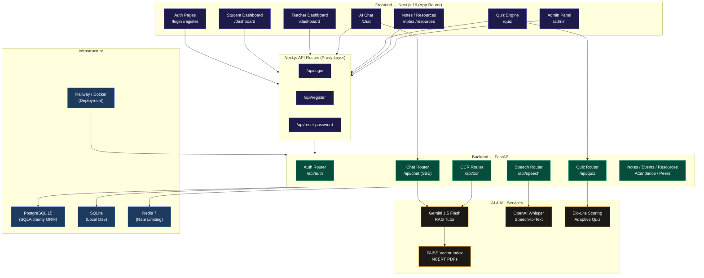

# 🎓 EduBridge AI

<p align="center">
  
  
  
  
  
  
  
  
  
</p>

<p align="center">
  <strong>Next-generation AI-powered learning ecosystem bridging academic divides across India.</strong><br/>
  Adaptive • Personalized • Multilingual • Secure • Inclusive
</p>

<p align="center">
  <a href="#-judges-evaluation-guide">Judges Guide</a> •
  <a href="#-security-hardening--cve-remediations">Security & Hardening</a> •
  <a href="#-core-engineering-features">Core Features</a> •
  <a href="#-architecture">Architecture</a> •
  <a href="#-tech-stack">Tech Stack</a> •
  <a href="#-quickstart">Quickstart</a> •
  <a href="#-api-reference">API Reference</a> •
  <a href="#-testing--verification">Testing & Verification</a>
</p>

---

## Overview

EduBridge AI is a full-stack educational platform built for students and teachers in underserved and mainstream schools alike. It combines a cinematic Next.js 16 frontend with a production-grade FastAPI backend to deliver real-time AI tutoring, adaptive assessments, multilingual speech interaction, and smart campus tooling — all under one roof.

The platform supports three distinct roles — **Student**, **Teacher**, and **Admin** — each with a tailored experience, role-gated dashboards, and access to relevant tools.

---

## 🧭 Judges' Evaluation Guide

To help you review and grade the EduBridge AI platform instantly, we have prepared a quick test-drive checklist.

### 1. Account Creation & Dashboard Access
- Go to the **Register** page (`/register`) and create a new account. Select the **Student** or **Teacher** role.
- Log in (`/login`). You will be redirected to the role-based dashboard:
  - **Student Dashboard**: Tracks study streak metrics, attendance visualizer (heatmaps), quiz ELO ratings, and personal study analytics.
  - **Teacher Dashboard**: Manages class attendance marking, notes sharing, and student grades.
  - **Admin Dashboard**: Inspects user bans, overrides credentials, and checks platform-wide API health.

### 2. Live AI RAG Tutoring
- Navigate to the **AI Tutor** page (`/chat`).
- Ask questions on NCERT Physics, Chemistry, or Math (e.g., *"Explain Newton's laws of motion"*).
- The bot retrieves contextual chunks from the local FAISS index (seeded with official NCERT book data) and streams answers token-by-token using **Server-Sent Events (SSE)**.

### 3. Elo-Lite Adaptive Quiz Engine
- Go to the **Quiz** page (`/quiz`).
- The system checks your current ELO rating (starts at **1200**) and queries a database seeded with **50+ NCERT questions** to serve one matching your exact difficulty bracket.
- Submit answers: correct submissions raise your ELO, incorrect ones lower it, and subsequent questions dynamically adjust in difficulty.

### 4. Handwriting OCR Equation Solver
- Go to the **OCR Scanner** page (`/ocr`).
- Upload an image containing a math equation (mock files can be found in `backend/data/`).
- The system extracts text, recognizes LaTeX equations, and triggers the Google Gemini Flash model to solve the problem step-by-step.

### 5. Chained Multilingual Speech
- Go to the **Speech Tutor** page (`/speech`).
- Upload an audio voice query (e.g., in Hindi or English).
- The backend transcribes it using **OpenAI Whisper**, automatically detects the language, and chains the transcript to the RAG AI Tutor to read back the response.

---

## 🛡️ Security Hardening & CVE Remediations

This production release has been systematically audited and hardened against standard OWASP vulnerabilities and CVE advisories.

### 1. Path Traversal Remediation
> [!WARNING]
> **Advisory**: Attackers crafting malicious filenames containing directory traversal sequences (e.g., `../../etc/passwd` or `/absolute/path`) could escape the target directory during document or audio uploads, overwriting critical server files.

* **Fix**: Implemented strict filename sanitization using `os.path.basename` in the note upload controller [notes.py](file:///c:/Users/hp/Edubridge-AI-1/backend/api/notes.py) and speech transcription controller [speech.py](file:///c:/Users/hp/Edubridge-AI-1/backend/api/speech.py) before compiling paths.
* **Code Example**:
  ```python
  safe_filename = os.path.basename(file.filename)
  file_path = os.path.join(UPLOAD_DIR, f"{user_id}_{safe_filename}")
  ```

### 2. JWS `crit` (Critical) Header Parameter Validation
> [!IMPORTANT]
> **Advisory**: Under PyJWT <= 2.11.0, JWS tokens containing unsupported critical headers in the `crit` parameter were accepted without validation, bypassing security controls (similar to CVE-2025-59420).

* **Fix**: 
  - Upgraded `pyjwt` to **2.12.0** in [requirements.txt](file:///c:/Users/hp/Edubridge-AI-1/backend/requirements.txt).
  - Added explicit header inspection in [auth_service.py](file:///c:/Users/hp/Edubridge-AI-1/backend/services/auth_service.py)'s `AuthService.decode_token` method to reject any tokens listing unsupported critical extensions in their headers, adhering to RFC 7515 §4.1.11.
* **Code Example**:
  ```python
  headers = jwt.get_unverified_header(token)
  crit = headers.get("crit")
  if crit is not None:
      if not isinstance(crit, list) or len(crit) == 0:
          raise jwt.InvalidTokenError("crit must be a non-empty list")
      for ext in crit:
          raise jwt.InvalidTokenError(f"Unsupported critical extension: {ext}")
  ```

### 3. XML External Entity (XXE) Injection Prevention
> [!WARNING]
> **Advisory**: Insecure XML parsing in `EverNoteLoader` (langchain-community < 0.3.27) allowed external entity references, exposing local files (like `/etc/passwd`) via malicious XML payloads.

* **Fix**: Upgraded `langchain-community` to **0.3.27** (and `langchain` to **0.3.30**) in [requirements.txt](file:///c:/Users/hp/Edubridge-AI-1/backend/requirements.txt) to disable external entity resolution.

### 4. CPU Exhaustion Denial of Service (DoS) Mitigations
> [!CAUTION]
> **Advisories**: 
> - Insecure multipart/form-data parsing in `python-multipart` allowed excessive CPU work via unterminated header fields or large headers.
> - Infinite loop bugs in `PyPDF2` (<= 3.0.1) text extraction allowed malformed PDFs to hang backend workers at 100% CPU.

* **Fix**:
  - Upgraded `python-multipart` to **0.0.32** to enforce strict header count/size limits.
  - Migrated text extraction from PyPDF2 to the modern **pypdf 6.13.0** library in [rag_service.py](file:///c:/Users/hp/Edubridge-AI-1/backend/services/rag_service.py) to resolve infinite loop conditions.

### 5. Stored/Reflected CSS XSS Injection
> [!WARNING]
> **Advisory**: Older versions of `postcss` (< 8.5.10) did not escape `</style>` tags when stringifying CSS ASTs, allowing attackers to inject scripts into style blocks.

* **Fix**: Added a dependency `override` inside [package.json](file:///c:/Users/hp/Edubridge-AI-1/package.json) to force all transitive `postcss` installations to secure version **8.5.15**.
  ```json
  "overrides": {
    "postcss": "^8.5.15"
  }
  ```

---

## ✨ Core Engineering Features

### 🤖 AI Tutor with RAG Pipeline
* **Contextual Retrieval**: Ingests textbook PDFs from the [backend/data](file:///c:/Users/hp/Edubridge-AI-1/backend/data) folder, splits content into 500-character chunks (50-character overlap) using LangChain's `RecursiveCharacterTextSplitter`, and embeds them into a local **FAISS** index.
* **Deterministic Fallback**: Includes a custom `SimpleEmbeddings` wrapper that dynamically uses high-fidelity HuggingFace embeddings when online, but falls back to a character-hash vector space in offline or test environments to prevent network failures.
* **Token Streaming**: Uses Server-Sent Events (SSE) to stream responses chunk-by-chunk for optimal user experience.

### 📈 Adaptive Quiz Engine (Elo-Lite)
* **ELO Formula**: Follows the chess rating methodology. ELO starts at 1200 and floors at 500.
  $$\Delta R = K \cdot (S - E)$$
  - Hard questions (difficulty $\ge 3$) correctly answered yield $+20$ ELO.
  - Easy questions (difficulty $\le 2$) incorrectly answered yield $-20$ ELO.
* **Smart Matching Tiers**:
  Queries the database on the fly and serves questions from the subject bracket corresponding to the student's current ELO score:
  - **ELO < 1000**: Difficulty Tier 1
  - **ELO < 1150**: Difficulty Tier 2
  - **ELO < 1300**: Difficulty Tier 3
  - **ELO < 1450**: Difficulty Tier 4
  - **ELO $\ge$ 1450**: Difficulty Tier 5

### 🎙️ Speech to Chat Pipeline
1. The student speaks a question and uploads the audio file.
2. The FastAPI backend processes it using **OpenAI Whisper** and reads language metadata.
3. Automatically maps Hindi, English, and Santali local dialects.
4. Feeds the transcription directly as input to the RAG tutor, returning a context-enriched response seamlessly.

---

## 🏗️ Architecture



---

## 🛠️ Tech Stack

### Frontend
| Technology | Version | Purpose |
|---|---|---|
| **Next.js** | 16.2.7 (Turbopack) | React framework with App Router & server proxying |
| **React** | 19.2.4 | User Interface component architecture |
| **TypeScript** | 5 | Structural static typing |
| **Tailwind CSS** | 4 | Next-gen utility styling engine |
| **Framer Motion** | 12 | Smooth animations and micro-interactions |
| **Zustand** | 5 | Local state container with localStorage persistence |
| **Recharts** | 3 | Performance analytics and dashboards rendering |

### Backend
| Technology | Version | Purpose |
|---|---|---|
| **FastAPI** | 0.111.0 | Asynchronous python backend API layer |
| **SQLAlchemy** | 2.0.31 | Database Object Relational Mapping (Postgres/SQLite) |
| **Pydantic** | 2.13.4 | Schema validation & configuration parsing |
| **python-multipart** | 0.0.32 | Secure form-data parser |
| **pypdf** | 6.13.0 | Safe text extraction from PDF files |
| **pyjwt** | 2.12.0 | RFC 7515 compliant JWS token handler |
| **FAISS** | 1.8.0 | Vector similarity search engine |

---

## 🚀 Quickstart

### Option A — Frontend Only (Quick Preview)
```bash
# Clone the repository
git clone https://github.com/diyamajee-spec/Edubridge-AI.git
cd Edubridge-AI

# Install dependencies
npm install

# Setup environment variables
cp .env.example .env.local
# Add: BACKEND_URL=http://127.0.0.1:8000

# Start development server
npm run dev
```
Open [http://localhost:3000](http://localhost:3000)

### Option B — Full Stack (Backend + Frontend)
#### 1. Backend Service
```bash
# Create and activate python virtual environment
python -m venv .venv
.venv\Scripts\activate      # Windows
# source .venv/bin/activate # macOS/Linux

# Install dependencies
pip install -r backend/requirements.txt

# Setup environment variables
cp backend/.env.example backend/.env
```
Edit `backend/.env` with your API keys:
```env
DATABASE_URL=sqlite:///./edubridge.db
SECRET_KEY=your_secret_key_here
GEMINI_API_KEY=your_gemini_api_key_here
```
Run FastAPI:
```bash
uvicorn backend.main:app --reload --host 127.0.0.1 --port 8000
```
Interactive API docs are live at [http://127.0.0.1:8000/docs](http://127.0.0.1:8000/docs).

#### 2. Frontend Service
```bash
npm install
npm run dev
```

---

## 📡 API Reference

Interactive docs: [`http://localhost:8000/docs`](http://localhost:8000/docs)

### Authentication — `/api/auth`
| Method | Endpoint | Description | Auth |
|---|---|---|---|
| `POST` | `/register` | Register a new user | — |
| `POST` | `/login` | Get JWT tokens and user profile | — |
| `GET` | `/me` | Get current user's profile | ✅ Bearer |
| `POST` | `/reset-password` | Request password reset OTP | — |

### Adaptive Quiz — `/api/quiz`
| Method | Endpoint | Description | Auth |
|---|---|---|---|
| `GET` | `/next?subject=physics` | Fetch ELO-matched quiz question | ✅ Bearer |
| `POST` | `/answer` | Submit answer, recalculate ELO | ✅ Bearer |
| `GET` | `/analytics/{student_id}` | Retrieve student accuracy analytics | ✅ Bearer |

### AI Services
| Method | Endpoint | Description | Auth |
|---|---|---|---|
| `POST` | `/api/chat` | Send question, streams SSE chunks | ✅ Bearer |
| `POST` | `/api/speech` | Upload audio to Whisper transcript | ✅ Bearer |
| `POST` | `/api/ocr` | Upload handwritten equation to Gemini Flash | ✅ Bearer |

---

## 🗂️ Project Structure
```
Edubridge-AI/
├── app/                          # Next.js App Router (Pages & Views)
├── backend/                      # FastAPI Backend
│   ├── api/                      # Route controllers
│   ├── services/                 # Business logic & services (RAG, Email, Auth)
│   ├── models/                   # SQLAlchemy ORM models
│   ├── schemas/                  # Pydantic schemas
│   ├── tests/                    # Backend testing suite
│   ├── utils/                    # Utility scripts (rate limiter)
│   └── main.py                   # App entrypoint
├── components/ui/                # Reusable UI component library
├── store/                        # Zustand states
├── faiss_index/                  # Persisted vector database indices
├── docker-compose.yml            # Container orchestration config
└── package.json                  # Next.js configurations
```

---

## 🧪 Testing & Verification

We have implemented complete backend test coverage to verify all endpoints and security constraints remain functional.

```bash
# Execute test suite
$env:PYTHONPATH="."; python -m pytest backend/tests -v
```

The test suite covers:
- **Authentication**: Registration, Login, Token generation.
- **RAG & SSE Streaming**: AI Tutor responsiveness.
- **OCR solving & Whisper Transcription**: Speech and image inputs.
- **Quiz bracket allocation**: ELO-lite computation.
- **Security Validation**: Directory traversal blockage, JWT crit header rejection.

---

## 🤝 Contributing

EduBridge AI was engineered by **Team Achievers** as part of a Hackathon MVP sprint.

| Name | Role |
|---|---|
| **Charu** | Frontend Architect & UI/UX Designer |
| **Bhargavram** | Backend, DevSecOps & AI Engineer |
| **Ankesh Srivastava** | Integration & Systems Documentation |

---

## 📄 License
This project is licensed under the **MIT License**. See [LICENSE](LICENSE) for details.
