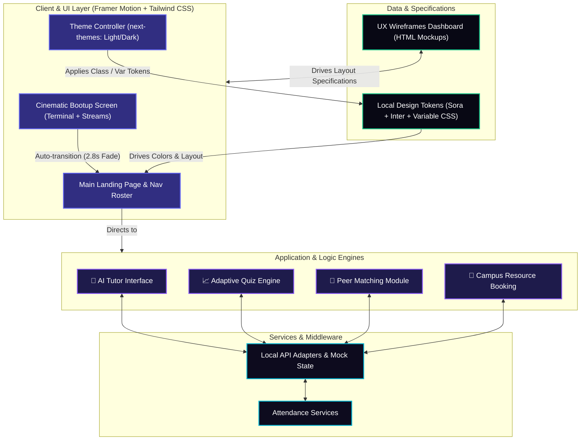

# 🎓 EduBridge AI
> **Next-generation AI-powered learning ecosystem designed to bridge academic divides.**  
> *Adaptive • Personalized • Highly Inclusive*

---

<p align="center">
  
  
  
  
  
</p>

---

## 🏛️ System Architecture

Below is the conceptual architecture showing how the interactive frontend modules, state controllers, local data sources, and the Next-Themes engine interlock to deliver a unified, cinematic, and responsive platform.



---

## ✨ Outstanding Features & Capabilities

| Module | Purpose | Cinematic Element | Key UX Screen |
| :--- | :--- | :--- | :--- |
| **💬 AI Tutor** | Direct tutoring and multi-lingual translation | Markdown stream transitions | Interactive 3-panel chat view |
| **📈 Adaptive Quiz** | Evaluates student knowledge gaps | Spring-physics animated card flips | Responsive results scorecard |
| **👥 Peer Matching** | Links students with complementary skills | Concentric pulse ring indicators | Group discussion portal |
| **🏫 Campus Tools** | Organizes schedules and bookings | Micro-animated timeline blocks | Lab resource scheduler |

---

## 🎭 Visual Excellence & Polish

*   **Cinematic Intro Sequence:** Includes vertical matrix data stream columns, circular ripple pulses, a shimmer loading progress indicator, and a cyber-themed status terminal that automatically guides the user to `/home` with custom expo transitions.
*   **Aesthetic Theme Engine:** Incorporates custom Variable-based Design CSS tokens. Includes an advanced Light/Dark toggler, resolving all text contrast limits and card container gradients for judges.

---

## 📂 Interactive UX Wireframes Library

A complete pixel-perfect mockup library is located in the `/wireframes` directory.

### Visualizing Dashboard & Screens
Open `wireframes/index.html` in any web browser to view:
1.  **Component Library:** Button styles, field validations, modals.
2.  **Auth Portals:** Adaptive forms for Register & Login.
3.  **Student Hub:** Streak counter, course analytics, widgets.
4.  **Notes Editor:** WYSIWYG editor with flashcards and summary sidebars.
5.  **Teacher/Admin Panel:** CPU gauges, class performance charts.

---

## ⚙️ Development & Quickstart

### Setup Instructions
1.  **Install project packages:**
    ```bash
    npm install
    ```
2.  **Launch local dev environment:**
    ```bash
    npm run dev
    ```
3.  **Open in browser:**
    Visit [http://localhost:3000](http://localhost:3000).

4.  **Produce build binary:**
    ```bash
    npm run build
    ```
